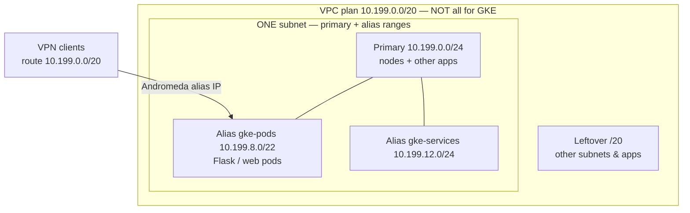

# GKE AI / lab cluster (scale-from-zero)

**Audience:** IT, platform, and Solutions engineering  
**Code:** [`gke-scalable.main.tf`](gke-scalable.main.tf)  
**Examples:** [`examples/`](examples/)

Shared **private, VPC-native GKE** for lab/demo work. Platform owns the cluster; **Solutions (and other app teams) only deploy apps** — they do not create clusters.

---

## Who does what

| Role | Does | Does not |
|------|------|----------|
| **Platform / IT** | Build & maintain the cluster (Terraform), VPC/alias CIDRs, NAT, firewalls, existing node pools | Day-to-day app deploys |
| **Solutions / app teams** | `kubectl apply` manifests; stage on `apps-pool`; promote to GPU/CPU; use timers / scale to 0 | Create GKE clusters, invent pod CIDRs, or manage node pools day-to-day |
| **Request to platform** | “Please add a node pool for SKU *X* (e.g. A100, TPU v5e)” | — |

**Correct mental model:** the cluster and pools are already there (declared in Terraform, scaled from zero). Worst case for a new accelerator is a **request to add an instance type / pool** — not a new cluster project.

```text
  Solutions team                         Platform (once)
  ──────────────                         ───────────────
  kubectl apply -f my-app.yaml    ◄────  terraform apply  (this folder)
  pick pool via nodeSelector             VPC + alias ranges + NAT
  timer / scale → 0 when done            add pool if new GPU/TPU SKU needed
```

---

## Why this design

| Goal | How we meet it |
|------|----------------|
| Solutions doesn’t manage GKE | One shared cluster; teams only deploy pods |
| Control cloud spend | GPU / CPU-heavy pools **scale from 0** — no idle L4/n4 VMs |
| Safe onboarding | Cheap **`apps-pool`** staging before GPU/TPU |
| Reach apps over VPN | **Andromeda / VPC-native**: Pod IPs are VPC **alias** addresses |
| Talk to VAST | Nodes tagged `vast-client` for existing firewall rules |
| Demo guardrails | Timed Jobs + autostop CronJobs so nothing burns overnight |

**Always-on cost is small on purpose:** only `system-pool` (kube-system) stays up. Everything else is demand-driven.

```text
  Developer flow (Solutions)
  ──────────────────────────
  1. Stage on apps-pool (cheap e2)     → prove VPN, Flask, VAST I/O
  2. Promote to GPU / CPU-heavy        → same cluster, different nodeSelector
  3. Finish or timer fires             → pods gone → expensive pools → 0 nodes
```

```text
  kubectl apply (GPU Job) ──► pending pod ──► gpu-l4-pool 0→1 ──► run ──► Job ends
                                                                      │
                                                                      ▼
                                                              nodes → 0 again
```

---

## Architecture

### Node pools

| Pool | Machine (default) | Min nodes | Purpose |
|------|-------------------|-----------|---------|
| `system-pool` | `e2-standard-4` | fixed (default **1**) | Kubernetes system pods only |
| `apps-pool` | `e2-standard-2` | **0** (optional `1` tiny staging floor) | Staging: Flask, smoke tests, VAST client I/O |
| `de-team-pool1` | `n4-standard-16` | **0** | CPU-heavy |
| `gpu-l4-pool` | `g2-standard-8` + NVIDIA L4 | **0** | GPU |

Terraform **declares** pools so they are ready to schedule into. Autoscaler **creates VMs only** when a matching pod is pending; when pods are gone, nodes return to **zero**.

```text
  system-pool     ── always on (small e2) — platform cost
  apps-pool       ── cheap staging (prefer min=0)
  cpu-heavy / GPU ── min=0 forever; cold-start beats idle burn
```

Need H100 / TPU / another GPU? **Request a new pool** (same pattern: `min_node_count = 0`). Do not stand up a second cluster for that.

### Networking (required pattern)

**One subnet** with **alias IP ranges** (VPC-native / Andromeda). Pod IPs are real VPC addresses — VPN clients that get the VPC plan can reach Flask/web **in the pod**.

**Example:** advertise **`10.199.0.0/20`** on the VPN for the **whole VPC** (other apps too). Do **not** give GKE the entire `/20`.

| Slice | Example CIDR | Size | Role |
|-------|--------------|------|------|
| VPC plan (VPN) | `10.199.0.0/20` | 4096 | Entire lab VPC routable space |
| Subnet primary | `10.199.0.0/24` | 256 | Node IPs + other VMs on this subnet |
| Alias `gke-pods` | `10.199.8.0/22` | 1024 | Pod IPs (VPN-reachable apps) |
| Alias `gke-services` | `10.199.12.0/24` | 256 | Service ClusterIPs |
| Leftover in `/20` | rest | — | Other subnets, apps, growth |

```text
                    VPN advertises 10.199.0.0/20  (whole VPC plan)
                                    │
     on-prem / laptop               │
     curl http://10.199.8.37:8080   │   (Flask / web running IN a pod)
              │                     ▼
              │              summit-vpc
              │    ┌─────────────────────────────────────────────┐
              │    │  ONE subnet: subnet19-us-central1           │
              │    │                                             │
              │    │  primary 10.199.0.0/24                      │
              │    │    ├─ GKE nodes                             │
              │    │    └─ other VMs / apps on same subnet       │
              │    │                                             │
              └───►│  alias gke-pods 10.199.8.0/22  ◄── Andromeda│
                   │    └─ Pod 10.199.8.37  Flask/web            │
                   │                                             │
                   │  alias gke-services 10.199.12.0/24          │
                   │    └─ ClusterIPs (in-cluster)               │
                   │                                             │
                   │  (rest of 10.199.0.0/20 → other resources)  │
                   └─────────────────────────────────────────────┘

  RIGHT: Pod IPs are VPC alias IPs → VPN route to /20 reaches the pod.
  WRONG: Routes-based GKE, or burning all of /20 as “the pod CIDR”.
```



Named secondaries must exist on the subnet **before** cluster apply. Private nodes need **Cloud NAT** + **Private Google Access**.

---

## Usage

### Platform — create / update the cluster (rarely)

```bash
cd gcp/GKE/gke-aicluster
terraform init
terraform plan
terraform apply
```

| Variable | Default | Meaning |
|----------|---------|---------|
| `project_id` | set for env | GCP project |
| `vpc_name` / `subnet_name` | summit-vpc / subnet19-… | Network |
| `system_node_count` | `1` | Only always-on system nodes |
| `apps_min_nodes` | `0` | Prefer `0`; `1` = tiny staging floor |
| `enable_apps_pool` / `enable_gpu_l4_pool` / `enable_cpu_heavy_pool` | `true` | Pool presence (GPU/CPU still min=0) |

```bash
gcloud container clusters get-credentials <cluster> --zone <zone> --project <project>
```

**Adding a new instance type:** platform copies an existing pool block (same `min_node_count = 0`, labels/taints), opens a small PR — Solutions keeps deploying apps the same way with a new `nodeSelector`.

### Solutions — deploy apps only

**1. Stage on cheap apps nodes**

```bash
kubectl apply -f examples/apps-staging-flask.yaml
# Verify VPN → pod, VAST I/O, basic behavior
kubectl scale deploy/apps-staging-flask --replicas=0
```

**2. GPU / CPU-heavy after staging works**

```bash
kubectl apply -f examples/job-gpu-l4-timed.yaml
# activeDeadlineSeconds → Job dies → GPU nodes → 0
```

**3. Long-running demos must autostop**

```bash
kubectl apply -f examples/deployment-autostop-cronjob.yaml
```

| Example | Purpose |
|---------|---------|
| [`examples/apps-staging-flask.yaml`](examples/apps-staging-flask.yaml) | Staging on `pool=apps` |
| [`examples/job-gpu-l4-timed.yaml`](examples/job-gpu-l4-timed.yaml) | GPU Job with hard time limit |
| [`examples/deployment-autostop-cronjob.yaml`](examples/deployment-autostop-cronjob.yaml) | Nightly / timer → replicas 0 |

### Pool selection (Solutions)

| Workload | `nodeSelector` / tolerations |
|----------|------------------------------|
| Staging | `pool: apps` |
| CPU heavy | tolerate `workload=heavy` |
| GPU L4 | `accelerator: l4` + tolerate `nvidia.com/gpu=present` + `nvidia.com/gpu: 1` |

---

## Cost expectations

- **Cold start** on first GPU/CPU-heavy pod after idle is expected (no idle burn).  
- **Forgotten** `replicas ≥ 1` Deployments keep nodes up — use timers / CronJobs / scale to 0.  
- **system-pool** = only required always-on compute.  
- New SKU = **pool request**, not a new cluster.

---

## Related

- Short technical checklist: [`gke-scalable.md`](gke-scalable.md)  
- GKE folder index: [`../README.md`](../README.md)  
- GCP map: [`../../README.md`](../../README.md)  
- VPC secondaries: [`../../CoreInfra/vpcs/core/`](../../CoreInfra/vpcs/core/)  

## Author

**Karl Vietmeier**
