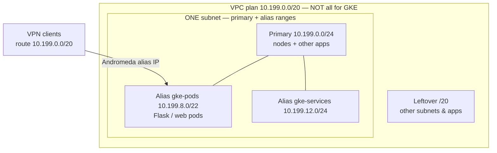

# GKE AI cluster — scale-to-zero + VPC-native networking

## The networking rule (read this first)

GKE must be **VPC-native (Andromeda)**: **one subnet**, node IPs on the **primary** range, Pod/Service IPs on **alias (secondary)** ranges on that same subnet.

Example VPC plan: advertise **`10.199.0.0/20`** over the VPN so on-prem (or other clouds) can reach apps. That `/20` is for the **whole VPC** — nodes, other VMs/apps, GKE, and growth. **Do not give GKE the entire `/20`.**

| Slice | Example CIDR | Size | Role |
|-------|--------------|------|------|
| VPC plan (VPN) | `10.199.0.0/20` | 4096 | Entire routable space for this VPC |
| Subnet primary | `10.199.0.0/24` | 256 | Nodes + other apps/resources on this subnet |
| Alias `gke-pods` | `10.199.8.0/22` | 1024 | Pod IPs — Flask / web / APIs (VPN-reachable) |
| Alias `gke-services` | `10.199.12.0/24` | 256 | Service ClusterIPs |
| Leftover in `/20` | `10.199.1–7.x`, `13–15.x`, … | rest | Other subnets, apps, growth |

Create those named secondaries on the subnet (e.g. via `CoreInfra/vpcs`) **before** `terraform apply`. This stack only **references** them:

```hcl
ip_allocation_policy {
  cluster_secondary_range_name  = "gke-pods"
  services_secondary_range_name = "gke-services"
}
```

### One subnet, alias ranges, VPN → pods

```text
                    VPN advertises 10.199.0.0/20  (whole VPC plan)
                                    │
     on-prem / laptop               │
     curl http://10.199.8.37:8080   │   (Flask / web running IN a pod)
              │                     ▼
              │              summit-vpc
              │    ┌─────────────────────────────────────────────┐
              │    │  ONE subnet: subnet19-us-central1           │
              │    │                                             │
              │    │  primary 10.199.0.0/24                      │
              │    │    ├─ GKE nodes                             │
              │    │    └─ other VMs / apps on same subnet       │
              │    │                                             │
              └───►│  alias gke-pods 10.199.8.0/22  ◄── Andromeda│
                   │    └─ Pod 10.199.8.37  Flask/web            │
                   │                                             │
                   │  alias gke-services 10.199.12.0/24          │
                   │    └─ ClusterIPs (in-cluster)               │
                   │                                             │
                   │  (rest of 10.199.0.0/20 → other resources)  │
                   └─────────────────────────────────────────────┘

  RIGHT: Pod IPs are VPC alias IPs → VPN route to /20 reaches the pod.
  WRONG: Routes-based GKE, or burning all of /20 as “the pod CIDR”.
```



---

## Scale-from-zero design

### 1. Replace the default pool
`remove_default_node_pool = true` plus a dedicated `system-pool` keeps kube-dns and system pods on right-sized `e2-standard-4` nodes.

### 2. HA anchor vs scale-to-zero
`system-pool` stays at **2** nodes. `de-team-pool1` autoscales **0..5** so expensive `n4-standard-16` capacity can go idle.

### 3. Taints and network tags
- **Taint** `workload=heavy:NoSchedule` — only tolerating pods land on (and scale up) the big pool.
- **Tag** `vast-client` — firewall rules track nodes without depending on ephemeral IPs.

```yaml
apiVersion: apps/v1
kind: Deployment
metadata:
  name: heavy-workload-app
spec:
  replicas: 1
  selector:
    matchLabels:
      app: heavy-workload
  template:
    metadata:
      labels:
        app: heavy-workload
    spec:
      tolerations:
        - key: "workload"
          operator: "Equal"
          value: "heavy"
          effect: "NoSchedule"
      containers:
        - name: flask-app
          image: gcr.io/google-samples/hello-app:1.0
          ports:
            - containerPort: 8080
```

With VPC-native networking, that pod gets an address in `10.199.8.0/22`. If the VPN advertises `10.199.0.0/20`, clients can reach it directly (firewall permitting) — that is the point of alias IPs on one subnet.

---

## Before apply

1. Ensure subnet secondaries `gke-pods` / `gke-services` exist with the CIDRs above (or your chosen slices of the `/20`).
2. Private nodes need **Cloud NAT** (+ Private Google Access) on the subnet.
3. Set a real `gke_version` only after `gcloud container get-server-config` (default is empty → GKE picks).
4. Master `/28` (`172.16.0.16/28` by default) must not overlap `10.199.0.0/20`.
